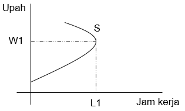

# Abstract
*This study aimed to determine the effect of hourly wage on the total working hours. The data is cross-sectional data of 706 Individuals in 1975, this data is available on Wooldridge. Data were analyzed using multiple linear regression. The results showed that hourly wage has a significant and nonlinear effect on total working hours. It means before the maximum point, the effect of hourly wage on total working hours is positive. After the maximum point, the effect turns out negative. These results match the supply labor theory.*

Penelitian ini bertujuan untuk mengetahui pengaruh upah per jam terhadap total jam kerja individu. Data yang digunakan adalah data cross-section dengan jumlah sampel 706 individu pada tahun 1975, data ini tersedia di buku Wooldridge. Analisis data menggunakan regresi OLS linear berganda. Hasil menunjukkan pengaruh upah per jam memiliki pengaruh yang signifikan dan tidak linear terhadap total jam kerja. Hal ini berarti sebelum titik maksimum, pengaruh dari upah perjam terhadap total jam kerja adalah positif. Setelah titik maksimum, pengaruhnya menjadi negatif. Hasil penelitian ini sesuai dengan teori penawaran tenaga kerja.

*Keywords: Upah, Jam Kerja, Alokasi Waktu, OLS Linear Berganda.*      
*JEL classification: J22*

# Introduction       
Sebagai salah satu faktor produksi baik di perusahaan atau perekonomian, sumber daya manusia memiliki peran yang penting. Karakteristik sumber daya manusia sangat beragam dan jumlah perusahaan yang juga semakin meningkat, hal ini menyebabkan adanya persaingan perusahaan - perusahaan untuk bisa mendapatkan pekerja. Pekerja dengan total jam kerja yang tinggi akan membantu perusahaan untuk mencapai profit maksimum. Tentu saja apabila membahas jam kerja para pekerja, bahasan mengenai upah akan selalu membersamai. Oleh karena itu, faktor upah menjadi penting dibahas pengaruhnya terhadap total jam kerja para pekerja.

Pertanyaan dalam penelitian ini adalah bagaimanakah pengaruh upah terhadap total jam kerja para pekerja. Variabel dependen yang di proxy kan dengan jumlah jam kerja (*totwrk*) yang dihabiskan oleh seorang pekerja dalam seminggu (dalam menit). Sedangkan upah per jam (*hrwage*) para pekerja merupakan variabel independen. Selain itu, variabel waktu santai (*rlxall*), kesehatan (*gdhlth*), usia (*age*), pendidikan (*educ*) juga dimasukan kedalam model sebagai variabel kontrol.

Dengan mempertimbangkan teori mengenai penawaran tenaga kerja dan teori pengaruh upah terhadap jam kerja (Teori alokasi waktu), maka dalam model dibentuklah formasi kuadratik pada variabel upah per jam pekerja. Dengan begitu tujuan penelitian dapat tercapai. Hasil penelitian menunjukan adanya pengaruh yang signifikan dan non-linear upah per jam pekerja terhadap total jam kerja pekerja, hal ini berarti pengaruhnya bersifat positif dan setelah melewati suatu titik maksimum hubungannya menjadi negatif, hasil penelitian menjadi relevan dengan teori yang ada.

# Theoritical Framework           
## Penawaran Tenaga Kerja         
Penawaran tenaga kerja dipengaruhi oleh keputusan seseorang apakah ia mau bekerja atau tidak. Keputusan ini tergantung pula pada tingkah laku seseorang untuk menggunakan waktunya, apakah akan digunakan untuk bekerja atau untuk kegiatan lain yang sifatnya lebih santai (konsumtif) atau bisa pula kombinasi keduanya. Apabila dikaitkan dengan tingkat upah, maka keputusan untuk bekerja seseorang akan dipengaruhi pula oleh tinggi rendahnya penghasilan seseorang. Apabila penghasilan tenaga kerja relatif sudah cukup tinggi, maka tenaga kerja tersebut cenderung untuk mengurangi waktu yang dialokasikan untuk bekerja. Hal tersebut menyebabkan bentuk dari kurva penawaran membelok ke kiri atau dikenal dengan *backward bending supply curve*.

```{r, echo=FALSE, fig.align='center', fig.cap="Figure 1. Kurva Penawaran Tenaga Kerja", fig.topcaption = TRUE, out.height= "50%", out.width= "50%"}

```

Pertanyaan penelitian ini yaitu untuk mengetahui pengaruh upah terhadap total jam kerja. Argumentasi kami yaitu tingkat upah yang tinggi akan memberikan dampak pada peningkatan total jam kerja, karena pemberian upah yang tinggi dapat memberikan motivasi kerja yang tinggi juga bagi pekerja sehingga dapat memenuhi kebutuhannya secara manusiawi. Dapat dikatakan bahwa hubungan tingkat upah dengan total jam kerja adalah positif.

## Alokasi Waktu (*Allocation of Time*)
Dalam teori alokasi waktu, ketika terjadi peningkatan upah maka terdapat dua pilihan yang dapat diambil oleh individu, yaitu ia akan memilih untuk meningkatkan konsumsi dan menikmati waktu luangnya atau meningkatkan alokasi waktu kerja nya. Hal ini lebih dikenal dengan nama efek pendapatan dan efek substitusi (*Substitution Effect* dan *Income Effect*) dari perubahan upah. Efek substitusi akan cenderung meningkatkan jam kerja karena pendapatan pengganti individu untuk waktu luang, yang sekarang relatif lebih mahal. Di sisi lain, efek pendapatan akan cenderung mengurangi jam kerja karena individu menggunakan daya belinya yang meningkat untuk membeli lebih banyak waktu luang. Sehingga jika dikaitkan dengan teori ekonomi mengenai teori alokasi waktu, hubungan tingkat upah dengan total jam kerja bisa positif atau negatif tergantung individu dalam menyikapi perubahan tingkat upah.

## Penelitian Terdahulu
Menurut penelitian terdahulu yang dilakukan oleh Rahmi Dewi (2018) dengan judul "Faktor-faktor yang Mempengaruhi Curahan Jam Kerja Tenaga Sektor Informal di Kota Pekanbaru" menunjukan bahwa tingkat upah berpengaruh negatif terhadap curahan jam kerja tenaga kerja sektor informal Di Kota Pekanbaru. Semakin naik upah, maka tenaga kerja akan memilih mengurangi jam kerja nya karena dengan upah yang mereka peroleh sudah bisa mencukupi kebutuhannya. kemudian hasil penelitian lain yang dilakukan oleh Murtiningsih dengan judul "Analisis faktor yang mempengaruhi jam kerja para pekerja di provinsi Jawa Tengah 2003 (analisis data sakernas 2003)" menunjukan hasil yang berbeda yaitu tingkat upah berpengaruh positif terhadap jam kerja. Semakin tinggi upah akan berpengaruh terhadap peningkatan jam kerja.

## Kerangka Pemikiran
Keputusan individu sangat bergantung pada batas tinggi rendahnya tingkat upah yang sedang berlaku. Dalam model, kami membentuk formasi kuadratik pada variabel upah per jam. Karena hal ini selaras dengan kurva penawaran tenaga kerja dimana individu ketika telah mendapatkan tingkat upah yang tinggi, maka pada titik tertentu individu tersebut akan mengurangi jam kerja nya atau arahnya menjadi negatif.

Kesehatan individu menjadi faktor yang penting dalam memberikan kontribusi bagi pekerjaannya. Individu yang rentan terhadap keluhan kesehatan, maka jam kerja yang dapat dijalankan tidak sebanyak individu yang tidak memiliki keluhan kesehatan. Sehingga dalam model ini kami memasukkan variabel dumi yaitu bernilai 1 jika sehat dan 0 jika tidak sehat sebagai variabel kontrol atau variabel yang dikendalikan sehingga pengaruh variabel bebas terhadap variabel terikat tidak dipengaruhi oleh faktor luar yang tidak diteliti. Sehingga hubungan kesehatan dengan total jam kerja adalah positif.

Karena masing-masing individu memiliki pilihannya sendiri terhadap jam kerja atau waktu santai yang akan dipilih sesuai dengan yang telah dijelaskan sebelumnya, maka dalam model ini kami memasukkan *rlxall* (waktu santai) sebagai variabel kontrol. Ketika individu mengkonsumsi waktu luang, maka total jam kerja nya akan berkurang sehingga hubungan waktu santai dengan total jam kerja adalah negatif.

Tingkat umur seseorang juga dapat mempengaruhi total jam kerja yang dijalankan. Semakin bertambahnya usia, total jam kerja yang dijalankan akan semakin sedikit karena kelelahan akan semakin cepat terjadi. Jika jam kerja melebihi kemampuan lama kerja tersebut maka akan menurunkan efisiensi dan efektivitas pekerjaannya. Sehingga hubungan umur dengan total jam kerja adalah negatif. Dan dalam model ini kami memasukkan age (umur) sebagai variabel kontrol.

Pendidikan juga dapat mempengaruhi tingkat produktivitas sumber daya manusia. Lama nya pendidikan yang ditempuh dapat meningkatkan nilai tambah atau kualitas sumber daya manusia. Hal ini dapat terjadi karena pendidikan yang dijalani seseorang dapat meningkatkan kemampuan dan keterampilan serta wawasan yang lebih luas, yang kemudian jam kerja juga akan meningkat hasil dari kemampuan yang didapatkan selama bersekolah. Dapat disimpulkan hubungan lamanya bersekolah atau menempuh pendidikan dengan total jam kerja adalah positif sehingga dalam model ini kami memasukkan lamanya bersekolah sebagai variabel kontrol.

# Empirical Strategy          
Model estimasi sebagai berikut:
$$
yi = β0 + β1xi + ΓZ + ui
$$
Dimana yi mengambarkan variabel dependen yaitu total jam kerja individu i, xi merupakan variabel independen utama yaitu upah perjam individu i, dan Z merupakan kumpulan variabel kontrol yang terdiri dari dumi 1 jika sehat, waktu santai, umur, dan lamanya sekolah dari masing-masing individu, dan ui merupakan *error terms*.
Sesuai dengan teori yang telah dipaparkan di bagian *Theoritical framework*, kami berekspektasi bahwa β1 memiliki pengaruh positif terhadap yi atau upah perjam memiliki pengaruh positif terhadap total jam kerja. Namun, dengan adanya teori backward bending labor curve pada teori penawaran tenaga kerja, kami juga berekspektasi bahwa pada titik tertentu β1 akan berpengaruh negatif terhadap yi. Sehingga kami menggunakan bentuk kuadratik pada variabel upah per jam (*hrwage*). Sementara itu, ekspektasi hubungan variabel kontrol dengan variabel dependen yaitu, variabel dumi yaitu 1 jika sehat berpengaruh positif terhadap total jam kerja, waktu santai berpengaruh negatif terhadap total jam kerja, umur berpengaruh negatif terhadap total jam kerja, dan lamanya bersekolah berpengaruh positif terhadap total jam kerja.

Estimasi model dari penelitian ini, sebagai berikut:
$$
𝑡𝑜𝑡𝑤𝑟𝑘 = β0 + β1 ℎ𝑟𝑤𝑎𝑔𝑒 + β2ℎ𝑟𝑤𝑎𝑔𝑒^2
+ β3𝑔𝑑ℎ𝑙𝑡ℎ + β4𝑟𝑙𝑥𝑎𝑙𝑙 + β5 𝑎𝑔𝑒 + β6𝑒𝑑𝑢c
$$
```{r, echo=FALSE, results='hide', warning=FALSE, message=FALSE}
library(wooldridge)
library(psych)
library(Hmisc)
library(lmtest)
library(stargazer)
library(car)
library(effects)
```

```{r}
data(sleep75, package = "wooldridge")
sleeping <- as.data.frame(sleep75) 
totwrk1 <- lm(totwrk ~ hrwage + I(hrwage^2) + gdhlth + rlxall + age + educ, data = sleeping)
```
Dimana:  

* totwrk : total jam kerja (dalam menit)  
* hrwage : upah per jam   
* hrwage^2 : upah per jam (model kuadratik)          
* gdhlth : dumi, 1 jika sehat       
* rlxall : waktu santai (dalam menit)        
* age : umur (dalam tahun)    
* educ : lamanya bersekolah (dalam tahun)    

Kemudian kami mengestimasi model menggunakan regresi standar *Ordinary Least Square (OLS)*. Sebelum di interpretasikan, kami menguji asumsi Gauss Markov terlebih dahulu untuk kemungkinan terjadinya multikolinearitas dengan menggunakan VIF dan heteroskedastisitas dengan menggunakan *Breusch-Pagan test*. Jika terjadi masalah heteroskedastisitas, maka langkah pengujian yang dapat diambil agar kesimpulan statistik sahih adalah dengan menggunakan *robust standard error*. Model juga telah diuji kemungkinan terjadinya masalah endogenitas agar memenuhi asumsi *zero conditional mean*.

# Data
## Deskripsi Statistik
Data yang digunakan dalam penelitian ini adalah data dari 706 individu yang merekam aktivitasnya di tahun 1975. Data ini bisa diperoleh dari buku Ekonometrika Wooldridge. Berikut adalah deskripsi statistik dari data tersebut.
```{r}
head(sleeping)
```
```{r}
str(sleeping)
```
```{r}
dim(sleeping)
```
```{r}
tail(sleeping)
```
```{r}
summary(sleeping)
```

Rata- rata total jam kerja pekerja pada tahun 1975 adalah 2123 menit dalam seminggu dengan nilai minimalnya adalah 0 menit, dan maksimal 6415 menit. Sedangkan rata-rata upah per jam pekerja adalah 5,08 dengan nilai minimal 0,35, dan nilai maksimal 35,51. Selanjutnya tertera juga rata-rata, nilai minimal, dan nilai maksimal dari masing-masing variabel kontrol.
```{r}
describe(sleeping)
```

## Correlation
Hubungan antara masing- masing variabel terbilang rendah karena nilainya kurang dari 0,50. Seperti hubungan variabel dependent (y= totwrk), yaitu jumlah jam kerja dengan variabel independen utama (x= hrwage), yaitu upah perjam memiliki nilai 0,16 dan di ilustrasikan dalam hasil dibawah ini, beserta dengan korelasi antar masing-masing variabel.
```{r}
totwrk1_selected <- sleeping[c("totwrk","hrwage","gdhlth","rlxall","age","educ")]
rcorr(as.matrix(totwrk1_selected)) 
```

## Outliers (Scatter plot, Boxplot, dan Histogram)
Outliers atau data yang memiliki pola berbeda dari kelompoknya dapat dilihat menggunakan histogram, scatter plot dan boxplot. 
```{r}
scatter.smooth(x=sleeping$totwrk, y=sleeping$hrwage, xlab="totwrk", ylab="hrwage", main="totwrk ~ hrwage", col="dark green")
```
```{r}
boxplot(sleeping$totwrk, main="totwrk")
```

```{r}
boxplot.stats(sleeping$totwrk)$out
```

```{r}
which(sleeping$totwrk %in% c(boxplot.stats(sleeping$totwrk)$out))
```
Distribusi frekuensi atau yang biasa disebut histogram dari data total jam kerja (*totwrk*) menunjukan sebaran data yang cenderung terdistribusi normal dengan sebaran data terbanyak diantara 1000-3000 menit total jam kerja.
```{r}
hist(sleeping$totwrk, xlab = "Minutes", main = "Histogram of Total work per week", prob=T)
```
Sedangkan histogram upah per jam (*hrwage*) menunjukan sebaran data yang berat ke sebelah kiri dari pada terdistribusi normal. Ilustrasi histogram upah perjam terdapat pada gambar di bawah ini.
```{r}
hist(sleeping$hrwage, xlab = "Hourly Wage", main = "Histogram of Hourly Wage", prob=T)
```

# Results
## Hasil Regresi Model
Berikut merupakan hasil dari regresi model:
```{r}
summary(totwrk1)
stargazer(totwrk1, type="text")
```

## Asumsi Gauss-Markov
### Uji Multikolinearitas
Model yang diestimasi kemudian dilakukan uji multikolinearitas menggunakan VIF dan menemukan bahwa tidak terdapat multikolinearitas yang parah diantara variabel karena nilai VIF berada dibawah 10.
```{r}
vif(totwrk1)
```

### Uji Heteroskeditas
Hasil *Breusch-Pagan test* di bawah ini menunjukan bahwa hipotesis null ditolak pada tingkat signifikansi 1%. Dengan demikian, dapat dinyatakan bahwa varian eror bersifat heteroskedastisitas. 
```{r}
bptest(totwrk1)
```

Oleh karena itu, *robust standard error* digunakan untuk menyesuaikan standar error:
```{r}
totwrk1_robust <- coeftest(totwrk1, vcov=hccm(totwrk1, type="hc0"))
totwrk1_robust
```

### Endogenitas
Selain itu, model juga mengalami masalah endogenitas dalam model karena terdapat variabel yang dihilangkan dalam model (*omitted variable bias*) dimana tidak dimasukkannya variabel seperti status pernikahan, banyaknya anak, dan waktu tidur yang diduga akan mempengaruhi variabel waktu santai (*rlxall*) serta pajak yang diduga akan mempengaruhi variabel upah per jam ke dalam model. Sehingga hasil estimasi tidak dapat menggambarkan hubungan kausalitas. 

## Hasil Regresi Model setelah penyesuaian
```{r}
stargazer(totwrk1_robust, type="text")
```
Hasil di atas menunjukkan bahwa hasil sesuai dengan harapan dimana *hrwage* dan hrwage kuadrat bernilai positif dan signifikan masing-masing pada level 1% dan 5% terhadap total jam kerja. Dilihat dari arah tanda hrwage yang positif dan hrwage kuadrat yang negatif, dapat diketahui bahwa hubungan antara upah per jam dan total jam kerja tidak linier. Pada tingkat upah per jam yang rendah, penambahan total jam kerja bertambah dengan waktu yang rendah pula. Dengan kata lain, hubungan total jam kerja dan upah per jam positif. Namun ketika upah per jam mencapai 19,5 (99,73/(2 x 2,56), maka total jam kerja dan upah per jam berhubungan negatif. Dimana kenaikan upah per jam akan mengakibatkan penurunan total jam kerja. Hubungan tersebut diilustrasikan pada gambar di bawah ini dimana kurva berbentuk seperti huruf u terbalik yang menyerupai bentuk kurva dalam teori *backward bending labor supply curve*.
```{r}
plot(effect("hrwage",totwrk1))
```
Variabel independen secara bersamaan menjelaskan variansi dari jumlah jam kerja sejumlah 16,8% seperti yang diindikasikan oleh *R square*. Variabel-variabel kontrol juga memiliki hasil yang sesuai dengan ekspektasi kecuali variabel educ yang memiliki hubungan negatif dengan variabel totwrk. Dengan mengontrol variabel lain tetap, koefisien hrwage dan hrwage kuadrat dapat diinterpretasikan sebagai berikut: apabila seseorang mengalami peningkatan upah sebanyak 1 per jam maka akan meningkatkan total jam kerja sebanyak 99,7 menit dan pada suatu titik peningkatan 1 upah per jam tersebut akan mengurangi total jam kerjanya sebanyak 2,56 menit.

Kemudian, jika dilihat dari deskripsi statistik, jumlah rata-rata upah per jam adalah 5,083, dengan jumlah minimum 0,35 dan maksimum 35,31. Hal tersebut mengindikasikan bahwa hanya sedikit individu dalam sampel yang memiliki upah per jam di atas 19,5 karena hanya terdapat 6 individu dari 532 sampel yang memiliki upah per jam di atas 19,5. Oleh karena itu, meskipun hubungan antara total jam kerja dengan upah per jam non-linear, bagian hubungan yang bersifat negatif menjadi tidak begitu relevan.

# Conslusion
Penelitian ini bertujuan untuk meneliti pengaruh dari upah per jam terhadap total jam kerja menggunakan analisis regresi OLS linear berganda berdasarkan data sleeping dari Wooldridge pada tahun 1975. Hasil penelitian menunjukkan dengan mengontrol variabel lain tetap, upah per jam memiliki pengaruh yang signifikan terhadap total jam kerja. Kemudian, hasil menunjukkan bahwa upah per jam memiliki pengaruh positif terhadap total jam kerja. Namun, pada titik tertentu yaitu titik 19,5 pada upah terjadi perubahan tanda hubungan antara total jam kerja dan upah per jam menjadi negatif. Hal ini selaras dengan teori alokasi waktu dan teori penawaran tenaga kerja dimana hubungan antara total jam kerja dengan upah per jam tidak linear.

# References
Borjas, George J. (2012). Labor Economics 6th Edition. New York: McGraw-Hill.       
Dewi, Rahmi. (2018). Faktor-faktor yang Mempengaruhi Curahan Jam Kerja Tenaga Sektor
Informal di Kota Pekanbaru. Pekanbaru: JOM FEB, Volume 1 Edisi 1.     
Heiss, F. (2016). Using R for introductory econometrics. Florian Heiss.      
Herwati, Endah. (2003). Analisis Faktor yang Mempengaruhi Jam Kerja Para Pekerja di Provinsi Jawa Tengah 2003 (Analisis Data Sakernas 2003). Semarang: digilib Universitas Negeri Semarang.     
Wooldridge, J. M. (2015). Introductory econometrics: A modern approach. Cengage learning.      
Nicholson, Walter., dan Christopher Snyder. (2017). Microeconomic Theory: Basic Principles and Extensions 12th Edition. Boston: Cengage Learning.    


